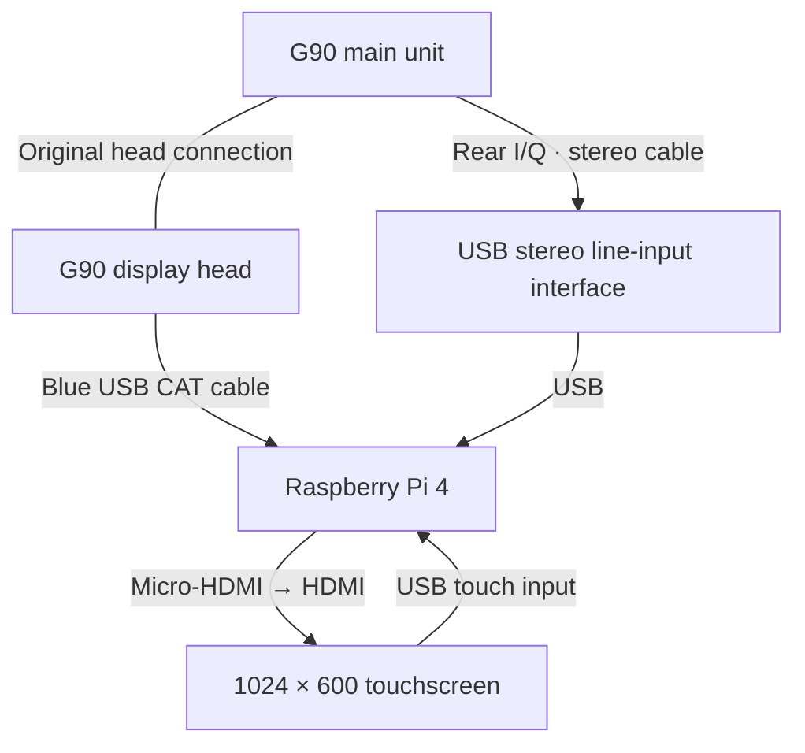

# HamTec G90 touchscreen controller — version 0.1

Local Raspberry Pi 4 controller for a ROADOM 1024×600 HDMI touchscreen.
This is working application source with a demo mode and a physical CAT/IQ
path. It has not been tested on a physical G90, Pi, or ROADOM display.

## Connections

1. Pi micro-HDMI → monitor HDMI. Connect its USB touch cable and supply
   monitor power according to the monitor instructions.
2. Keep the stock G90 head connected to the body. Boot the G90 before
   inserting the supplied blue USB serial cable in the head's communication
   socket. Connect USB to the Pi. The rear COMM socket is not the CAT socket.
3. Rear I/Q → true stereo line input on your USB audio interface → Pi USB.
   Both capture channels are required. A mono microphone input is unsuitable.
   A stereo-capable adapter is assumed, not verified. Confirm input levels,
   channel assignment, and electrical compatibility before connection. Turn
   off microphone enhancement/AGC; start with low input gain. Use ferrites
   and suitable isolation where needed. Do not connect serial signals to
   the audio adapter or use RS-232 voltage levels at the radio jack.

## Install on Raspberry Pi OS

The following commands install the application in a virtual environment.
Run from the extracted `g90-controller` directory. They require internet
access on the Pi. No installation or changes have been made to your Pi.

```bash
sudo apt update
sudo apt install python3-venv libportaudio2
python3 -m venv .venv
source .venv/bin/activate
pip install -r requirements.txt
python app.py
```

Open `http://127.0.0.1:8080` on the Pi. Default mode is DEMO. It sends no radio
commands. The spectrum stays blank without real input; no synthetic signal
or SWR results are presented as measurements.

Use Chromium's kiosk option to fill the touch display, if Chromium is
installed (the executable name varies by Raspberry Pi OS version):

```bash
chromium --kiosk http://127.0.0.1:8080
```

## Find the serial port and stereo capture device

```bash
ls -l /dev/serial/by-id/
source .venv/bin/activate
python -m sounddevice
```

Choose the audio INPUT device that exposes at least two input channels.
Use a stable `/dev/serial/by-id/` path for CAT. If serial access is denied,
check membership of the Pi OS serial access group, commonly `dialout`.
Do not run the web application as root.

Start a physical session (replace the illustrative port and device index):

```bash
python app.py --live --port /dev/serial/by-id/YOUR_G90_CABLE --iq-device 2
```

Boot the G90, insert its head CAT cable, then press CONNECT CAT on screen.
There are no automatic serial commands before you press that button.
Frequency polling starts after successful connection. Stop the application
and disconnect the head CAT cable before cycling G90 power. Do not leave
software polling while the radio boots into its firmware update interface.

The default address is 88 hex. If reads fail, stop the app and try:

```bash
python app.py --live --port /dev/serial/by-id/YOUR_G90_CABLE --address 70 --iq-device 2
```

Use `--swap-iq` for reversed spectral orientation. Default capture is 48 kHz;
`--sample-rate 96000` is optional only if both radio output and adapter make
it useful. Sample rate is not a claim about useful G90 RF bandwidth.

## Implemented controls

- Frequency, mode, band frequency jumps, tuning step, touch drag tuning dial,
  frequency keypad, VFO A/B and swap, split.
- AF level, squelch, RF power level, CW pitch/speed level, PRE, AGC, NB, COMP,
  dial lock, ATT toggle.
- ATU bypass/enable/start and status query, PTT release (RECEIVE).
- S, power and SWR raw meter queries; serial command diagnostics.
- Stereo complex FFT, spectrum/waterfall, I/Q swap option, input clipping
  warning, and stale-capture suppression.
- Browser-local frequency/mode presets (not radio memory writes).

Start tuning is disabled in live mode unless launched with `--allow-tune`.
Enable this only after normal read/write controls have been checked and with
a suitable antenna or dummy load and a permitted transmit frequency:

```bash
python app.py --live --port /dev/serial/by-id/YOUR_G90_CABLE --iq-device 2 --allow-tune
```

START TUNE requires a separate on-screen confirmation. It produces RF.
RECEIVE sends CAT PTT release; it is NOT a verified abort for the radio's
autonomous tuner. It may not terminate an ATU cycle. Keep physical radio
controls accessible. If the cable disconnects, software cannot guarantee
receipt of a release command. No general PTT-on control is provided.

## Material limitations

- SWR sweep is intentionally unavailable. No verified CAT command launches
  the built-in scanner or downloads its graph. A future Pi sweep needs
  validated low-power carrier generation, SWR conversion, transmit-frequency
  limits, timing, stop behaviour and restoration of radio settings.
- Meter displays show **raw** numbers, not calibrated watts/S-units/SWR ratio.
  No SWR graph or ratio is invented from unverified conversion.
- Level sliders use 0–255 CAT units. Watts/WPM/Hz calibration is pending.
  Strict BCD decoding will report unsupported/non-BCD firmware responses,
  rather than silently guessing their meaning.
- Filter/RIT controls are disabled; firmware-specific extensions, DATA modes,
  RF gain, microphone settings, radio memories, VOX, menu controls, audio
  playback and recording are not implemented. CAT does not expose everything.
- AGC is shown as numeric 0–3 because documented names and library mappings
  differ; check each state on the physical radio for your firmware.
- Frequency/mode and tuner state are polled. Switch/level values are updated
  after controller actions; initial slider values are defaults, not polled
  radio state. Switch read-back is verified. VFO/split labels represent
  acknowledged requests, not separately verified current radio state.
- Firmware-dependent ATT may toggle rather than accept an absolute state.
  Read its diagnostic response and verify physically.
- Use one serial client at a time. Close flrig/WSJT-X CAT polling while this
  app owns the port. Bind remains loopback-only; do not expose it publicly.

## Checks before RF use

1. Confirm two-channel capture and tune past a known signal to verify I/Q
   orientation. Adjust gain if clipping appears.
2. Check frequency/mode read-back and all switches against the physical G90.
3. Verify level scaling with your exact head/base firmware. Do not infer
   RF watts from slider position until calibrated.
4. Only then test ATU start at a permitted frequency with a suitable load.
5. Keep SWR sweep disabled until a validated implementation exists.

## Protocol sources

- Radioddity, *G90 CAT control and digital modes v1.0*, command tables:
  https://device.report/m/3fa57e83d810eafc0a99998edb5d8759e366c7eef4a3dd3329cf585d51aecf0d
- G90 operation manual:
  https://device.report/m/93ee18ec37ce5a7a753ac46eed8ebc196b4bc99cffe88e30c34e32807f3cc4ec
- Hamlib G90 source, used to cross-check framing/settings and known limits:
  https://github.com/Hamlib/Hamlib/blob/master/rigs/icom/xiegu.c

See COMMANDS.md for the baseline command map. Tests run with:

```bash
python -m unittest discover -s tests -v
```

# 📻 HamTec G90 Touchscreen Controller


A Raspberry Pi touchscreen controller for the **Xiegu G90**, combining a G90-inspired interface, CAT controls, and a stereo I/Q spectrum and waterfall.

Designed for a **Raspberry Pi 4** and a **ROADOM 10.1-inch HDMI touchscreen** with a resolution of **1024 × 600**.

> **Experimental release:** Software tests pass, but physical radio operation and touchscreen layout still need verification. SWR sweeping is currently unavailable.

## ✨ Features

- Large frequency display and touch tuning dial.
- Frequency keypad, tuning steps and band shortcuts.
- Mode selection, VFO A/B, VFO swap and split.
- AF volume, squelch and RF power level controls.
- CW speed and sidetone level controls.
- PRE, ATT, AGC, noise blanker, compressor and dial lock.
- Antenna tuner bypass, enable and optional start-tuning command.
- Raw S-meter, RF power and SWR readings.
- Stereo I/Q spectrum and waterfall.
- I/Q channel swap and input clipping warning.
- Browser-local frequency and mode presets.
- CAT diagnostics.
- Demo mode that sends no radio commands.

## 🔌 Wiring diagram



## 🧰 Hardware required

| Item | Purpose |
| --- | --- |
| Raspberry Pi 4 and suitable power supply | Runs the controller |
| HDMI touchscreen with USB touch input | Displays and operates the interface |
| Micro-HDMI to HDMI cable | Connects the Pi display output |
| Supplied blue G90 CAT cable | Connects the radio head to Pi USB |
| USB audio interface with stereo line input | Captures both I and Q channels |
| Suitable 3.5 mm stereo audio cable | Connects the rear I/Q output |

**Important:** A mono USB microphone adapter cannot capture proper I/Q data. Stereo headphone output does not mean an adapter has stereo recording input.

Confirm input levels and connector wiring before connecting the radio.

## 📋 Connection instructions

1. Connect the Pi’s micro-HDMI output to the touchscreen.
2. Connect the touchscreen’s USB touch connection to the Pi.
3. Power the touchscreen according to its instructions.
4. Keep the original G90 display head connected to the main unit.
5. Boot the G90 before inserting the blue CAT cable into the head communication jack.
6. Connect the CAT cable’s USB end to the Pi.
7. Connect the rear I/Q output to the USB interface’s stereo line input.

The rear **COMM** jack is not the CAT connection used by this project.

Stop the application and disconnect the head CAT cable before cycling radio power. Avoid CAT polling while the G90 is booting.

## 🚀 Install on your Pi

Use **Raspberry Pi OS with desktop**, preferably 64-bit. This release has not been verified against a specific Pi OS version.

Download and extract the project. For the supplied ZIP:

```bash
cd ~/Downloads
unzip g90-controller-v0.1.zip
cd g90-controller
```

For a GitHub source ZIP, enter the extracted folder containing `app.py` and `requirements.txt`.

Install the dependencies:

```bash
sudo apt update
sudo apt install -y python3-venv libportaudio2

python3 -m venv .venv
source .venv/bin/activate

pip install -r requirements.txt
```

## ▶️ Run demo mode

```bash
python app.py
```

Open Chromium on the Pi and visit:

**http://127.0.0.1:8080**

Keep the terminal open while using the controller. Press **Ctrl+C** in that terminal to stop it.

Demo mode sends no radio commands. The spectrum remains blank without a real I/Q input.

### Run again later

Open a terminal in the application folder:

```bash
source .venv/bin/activate
python app.py
```

## 🖥️ Full-screen touchscreen mode

With the application running, open another terminal:

```bash
chromium --kiosk http://127.0.0.1:8080
```

Some installations use `chromium-browser` instead.

Automatic startup is not configured in this release.

## 📡 Run with the G90

### Find your CAT cable

```bash
ls -l /dev/serial/by-id/
```

Use the path belonging to your G90 cable.

### Find your stereo audio input

With the virtual environment active:

```bash
python -m sounddevice
```

Choose an input device with at least **two input channels**.

### Start live mode

Replace the serial path and example audio device number:

```bash
python app.py --live \
  --port /dev/serial/by-id/YOUR_G90_CABLE \
  --iq-device 2
```

After the radio has booted and its CAT cable is connected, press **CONNECT CAT** on screen.

You can use CAT without I/Q capture by omitting `--iq-device`.

### CAT settings

| Setting | Value |
| --- | --- |
| Baud rate | 19200 |
| Data bits | 8 |
| Parity | None |
| Stop bits | 1 |
| Flow control | None |
| Default radio address | `88` hexadecimal |
| Alternative address | `70` hexadecimal |

If the radio does not respond, stop the application and try `--address 70`.

Close other programs using the CAT port before running this controller.

## 📶 Stereo I/Q display

The application combines the two input channels into a complex FFT for the spectrum and waterfall.

- Disable microphone enhancement and automatic gain control.
- Start with low input gain.
- Reduce gain if the clipping warning appears.
- Use `--swap-iq` if the spectrum is reversed.

Example:

```bash
python app.py --live \
  --port /dev/serial/by-id/YOUR_G90_CABLE \
  --iq-device 2 \
  --swap-iq
```

The default sample rate is **48 kHz**. A 96 kHz option is available where supported and useful.

Capture rate does not establish the radio’s useful RF bandwidth. Spectrum values are relative **dBFS**, not calibrated RF dBm.

## 🔧 Antenna tuner

ATU bypass and enable controls are available.

Starting an automatic tune produces RF, so live tuning is disabled by default. After checking normal CAT operation and the radio settings, enable it using:

```bash
python app.py --live \
  --port /dev/serial/by-id/YOUR_G90_CABLE \
  --iq-device 2 \
  --allow-tune
```

**START TUNE** also requires an on-screen confirmation.

Use a suitable antenna or load and a permitted transmit frequency. Keep the physical radio controls accessible.

The **RECEIVE** button sends CAT PTT release. It is not a verified abort for an autonomous tuner cycle. A disconnected cable prevents command delivery.

## 📉 SWR analyser status

The SWR page currently displays a **raw CAT meter value**.

**SWR sweeping and calibrated SWR ratios are not implemented.**

No verified CAT command to launch the built-in scanner or download its graph was found in the consulted command tables.

A future Pi-controlled sweep needs verified:

- Low-power carrier generation.
- SWR meter conversion.
- Frequency and timing limits.
- Stop behaviour.
- Restoration of radio settings.

**The I/Q input alone cannot measure antenna SWR.**

## ⚙️ Launch options

| Option | Purpose |
| --- | --- |
| `--live` | Enable physical CAT operation |
| `--port PATH` | Select the serial cable |
| `--address HEX` | Set radio address; default `88` |
| `--iq-device INDEX_OR_NAME` | Select stereo capture input |
| `--sample-rate 48000` | Default capture rate |
| `--sample-rate 96000` | Optional capture rate |
| `--swap-iq` | Reverse I/Q channel assignment |
| `--allow-tune` | Permit the RF-producing ATU start command |

## 🚧 Current limitations

- Physical hardware and visual layout remain unverified.
- Level sliders use **0–255 CAT units**. Watts, WPM and Hz calibration is pending.
- Meter displays show raw values.
- Initial slider values are application defaults rather than automatically read radio settings.
- Levels and switches are read back after controller changes.
- Frequency, mode and tuner status are polled.
- VFO and split labels represent requested operations rather than separately verified radio state.
- AGC uses numeric state labels pending firmware verification.
- ATT behaviour may vary with firmware.
- Filter and RIT controls are disabled.
- DATA modes, RF gain, radio memory writes, microphone/menu settings, audio playback and recording are not implemented.
- Frequency presets are saved in the Pi browser.
- The application is intended for local use and binds to `127.0.0.1`.

## 🛠️ Troubleshooting

| Problem | What to check |
| --- | --- |
| Controller page will not open | Keep `python app.py` running and open the local address on the Pi |
| CAT does not respond | Radio power, head jack, serial path, address and competing CAT programs |
| Serial permission denied | Serial access group, commonly `dialout`; do not run the app as root |
| No spectrum | Stereo input device, I/Q cable and sample rate |
| Spectrum reversed | Restart with `--swap-iq` |
| Input clipping | Reduce gain and disable microphone processing |
| Tuner start unavailable | Live tuning requires `--allow-tune` after bench checks |
| Command rejected | Record head/base firmware versions and the CAT diagnostic frame |

## 🧪 Testing

From the application folder, with dependencies installed:

```bash
source .venv/bin/activate
python -m unittest discover -s tests -v
```

**16 software tests passed** in the build environment.

Tests cover CAT encoding, response handling, application requests, the tuner transmit gate and I/Q FFT behaviour.

Python compilation, template rendering and JavaScript syntax were also checked. Browser visual verification could not run in the build environment.

See [VALIDATION.md](VALIDATION.md) for details and [COMMANDS.md](COMMANDS.md) for the CAT command map.

## 🤝 Contributing

Firmware reports and bench results are welcome.

Please include:

- Raspberry Pi model and OS version.
- G90 head and base firmware versions.
- CAT cable and USB audio adapter details.
- Steps to reproduce the issue.
- Relevant CAT diagnostic frames.

## 📚 References

- [Radioddity G90 CAT control and digital modes guide](https://device.report/m/3fa57e83d810eafc0a99998edb5d8759e366c7eef4a3dd3329cf585d51aecf0d)
- [G90 operating manual](https://device.report/m/93ee18ec37ce5a7a753ac46eed8ebc196b4bc99cffe88e30c34e32807f3cc4ec)
- [Hamlib Xiegu/G90 implementation](https://github.com/Hamlib/Hamlib/blob/master/rigs/icom/xiegu.c)

---

An independent **HamTec** project. No affiliation with or endorsement by Xiegu or ROADOM is claimed.
